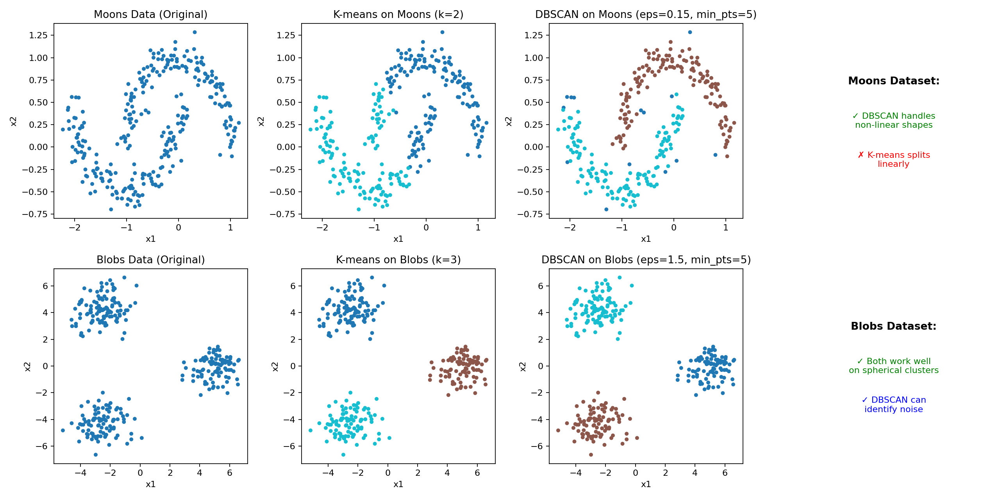
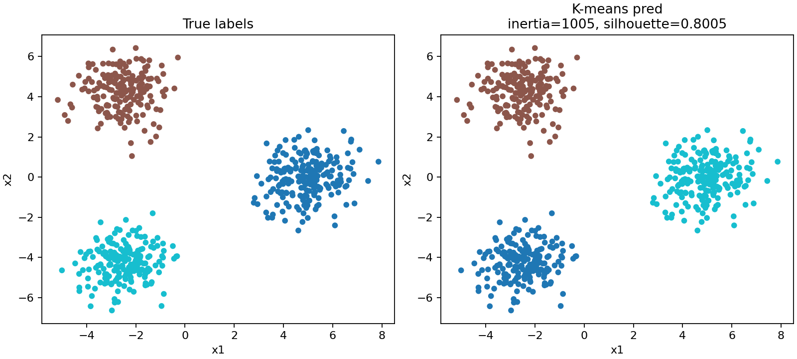
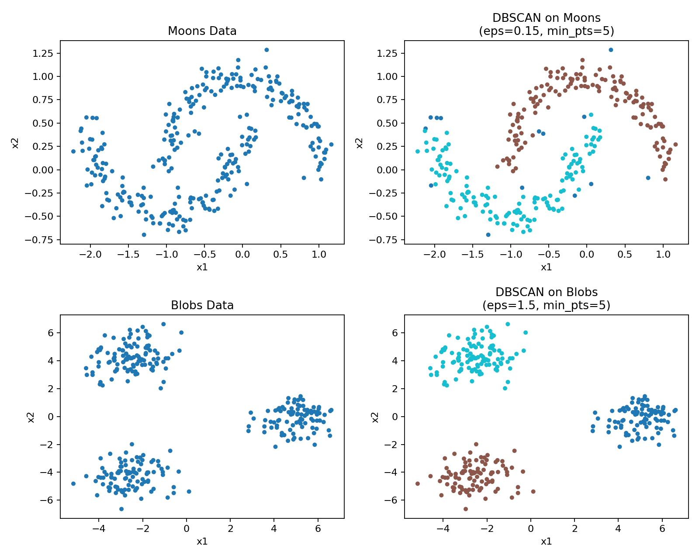

# k-means (K-средних) и DBSCAN на C — с нуля

Реализация **k-means** (алгоритм Ллойда) и **DBSCAN** (Density-Based Spatial Clustering) **на чистом C**: библиотечная функция для кластеризации, CLI-демо для работы с CSV, генерация синтетических данных и визуализация результатов.

## Визуализация результатов

### Сравнение K-means и DBSCAN на разных типах данных



*На рисунке показано сравнение алгоритмов K-means и DBSCAN на двух типах данных:*
- *Moons (полумесяцы) — DBSCAN успешно разделяет нелинейные структуры, в то время как K-means делит их линейно*
- *Blobs (сферические кластеры) — оба алгоритма работают хорошо на сферических кластерах, но DBSCAN может выделять шум*

### Пример кластеризации



### Визуализация DBSCAN



*На рисунке показано применение алгоритма DBSCAN на двух типах данных:*
- *Moons (полумесяцы) — DBSCAN успешно разделяет нелинейные структуры*
- *Blobs (сферические кластеры) — DBSCAN корректно выделяет кластеры на основе плотности*

## Что это делает

### K-means
Алгоритм k-means разбивает набор `d`-мерных точек на `k` кластеров так, чтобы каждая точка относилась к кластеру с ближайшим центроидом (средним).

### DBSCAN
Алгоритм DBSCAN (Density-Based Spatial Clustering of Applications with Noise) группирует точки на основе плотности распределения:
- **Ядерные точки** — имеют достаточное количество соседей в радиусе `eps`
- **Граничные точки** — находятся в окрестности ядерных точек
- **Шум** — изолированные точки, не принадлежащие ни одному кластеру

## Когда это использовать

### K-means
- Когда у вас **числовые данные** (векторы признаков)
- Когда **нет меток** классов и нужно разбить данные на группы
- Когда вы **знаете `k`** (количество кластеров) или хотите автоматически подобрать его с помощью **метода локтя**
- Для сферических кластеров примерно одинакового размера

### DBSCAN
- Когда форма кластеров **произвольная** (не обязательно сферическая)
- Когда есть **выбросы/шум** в данных
- Когда **неизвестно количество кластеров** заранее
- Для данных с разной плотностью распределения

## Быстрый старт

1) Сгенерировать данные:

### Генерация сферических кластеров (blobs)

```bash
python tools/generate_blobs.py --out data.csv --type blobs --samples 600 --centers 3
```

### Генерация данных «полумесяцы» (moons)

```bash
python tools/generate_blobs.py --out data.csv --type moons --samples 600
```

### Параметры генератора

- `--type` — тип данных: `blobs` (сферические кластеры) или `moons` (полумесяцы)
- `--samples` — количество образцов (по умолчанию 600)
- `--centers` — количество центров, только для `blobs` (по умолчанию 3)
- `--std` — стандартное отклонение шума, только для `blobs` (по умолчанию 0.9)
- `--noise` — уровень шума, только для `moons` (по умолчанию 0.1)
- `--seed` — seed для воспроизводимости

Чтобы получить повторяемый датасет (одинаковый на разных запусках), укажите `--seed`, например:

```bash
# Для blobs
python tools/generate_blobs.py --out data.csv --type blobs --samples 600 --centers 3 --seed 42

# Для moons
python tools/generate_blobs.py --out data.csv --type moons --samples 600 --seed 42
```

2) Собрать (Make):

```bash
make all
```

Или собрать отдельные демо-программы:

```bash
make kmeans_demo      # только K-means демо
make elbow_demo       # метод локтя
make clustering_demo  # универсальное демо с выбором алгоритма
```

3) Запустить демо:

### Универсальное демо с выбором алгоритма

```bash
# K-means с 3 кластерами
./build/clustering_demo data.csv 3 kmeans

# K-means с настройками (k=3, max_iter=200, инициализация random)
./build/clustering_demo data.csv 3 200 0 kmeans

# DBSCAN с параметрами eps=0.5, min_pts=4
./build/clustering_demo data.csv 0.5 4 dbscan
```

### Классическое K-means демо

Windows (PowerShell), если собирали с `--config Release`:

```powershell
.\build\Release\kmeans_demo.exe --in data.csv --k 3 --out pred.csv --seed 42
```

Linux/macOS:

```bash
./build/kmeans_demo --in data.csv --k 3 --out pred.csv --seed 42
```

4) Визуализировать:

```bash
python tools/plot_results.py --data data.csv --pred pred.csv
```

## Метод локтя (подбор оптимального k)

Если вы не знаете количество кластеров `k`, используйте метод локтя для его автоматического подбора. Метод запускает алгоритм для диапазона значений `k` и вычисляет инерцию (сумму квадратов расстояний от точек до центроидов). Оптимальное `k` выбирается в точке «излома» графика инерции.

Запуск демо-программы метода локтя:

```bash
# Сборка
make elbow_demo

# Запуск (автоматически подберет k в диапазоне [2, 10])
./elbow_demo --in data.csv --max-k 10
```

Программа выведет таблицу инерций для каждого `k` и порекомендует оптимальное значение.

Важно: папка `build/` привязана к пути на диске и конкретной машине. Если переносите проект на другой ПК (или переместили папку проекта), просто удалите `build/` и пересоздайте:

```powershell
Remove-Item -Recurse -Force .\build
cmake -S . -B build
cmake --build build --config Release
```

## Пример использования как библиотеки (C API)

Ниже — минимальная схема вызова: задаём параметры, передаём матрицу `X` размера `n_samples × n_features`, получаем `labels` и `centroids`.

```c
#include "kmeans.h"

// X: плоский массив длиной n_samples*n_features (строчно-ориентированно)
// labels_out: длина n_samples
// centroids_out: длина k*n_features
int rc = kmeans_fit(X, n_samples, n_features, &params, labels_out, centroids_out, &inertia);
```

См. заголовок `src/kmeans.h` и демо `demo/kmeans_demo.c` для полного примера.

## Сложность

Если `k` и `d` фиксированы, время работы одной итерации — `O(n*k*d)`, а всего — `O(n*k*d*i)`, где:

- `n` — число объектов (samples)
- `k` — число кластеров
- `d` — размерность (features)
- `i` — число итераций до сходимости

На данных с выраженной кластерной структурой обычно сходится за небольшое число итераций.

## Параметры и опции

### K-means

Параметры алгоритма задаются через `kmeans_params_t` (см. `src/kmeans.h`):

- `k` — количество кластеров
- `max_iters` — максимум итераций
- `tol` — порог сходимости (0 — отключить проверку по сдвигу центроидов)
- `seed` — seed для генератора случайных чисел
- `init_method` — инициализация центроидов (случайная или k-means++)

### DBSCAN

Параметры алгоритма задаются в функции `dbscan_cluster` (см. `src/dbscan.h`):

- `eps` — радиус окрестности для поиска соседей
- `min_pts` — минимальное количество точек для образования плотной области

## Структура проекта

- `src/kmeans.h`, `src/kmeans.c` — реализация k-means и метод локтя (`kmeans_elbow`)
- `src/dbscan.h`, `src/dbscan.c` — реализация алгоритма DBSCAN
- `src/csv.h`, `src/csv.c` — чтение `data.csv` и запись `pred.csv`
- `demo/kmeans_demo.c` — CLI-демо (читает CSV → кластеризует → пишет CSV)
- `demo/elbow_demo.c` — демо для подбора оптимального `k` методом локтя
- `demo/clustering_demo.c` — универсальное демо с выбором алгоритма (K-means или DBSCAN)
- `tools/generate_blobs.py` — генерация `data.csv`
- `tools/plot_results.py` — построение `clusters.png` и расчёт метрик

## Сборка без CMake (MSVC)

Откройте **x64 Native Tools Command Prompt for VS** и выполните:

```bat
cl /O2 /I src demo\kmeans_demo.c src\kmeans.c src\csv.c /Fe:kmeans_demo.exe
kmeans_demo.exe --in data.csv --k 3 --out pred.csv
```

